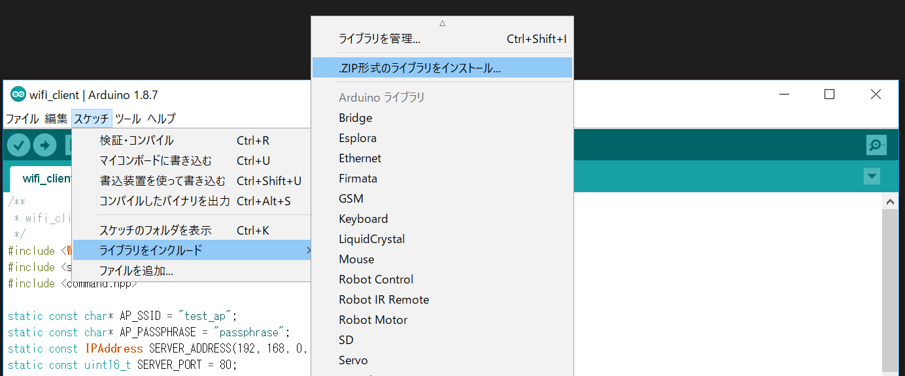
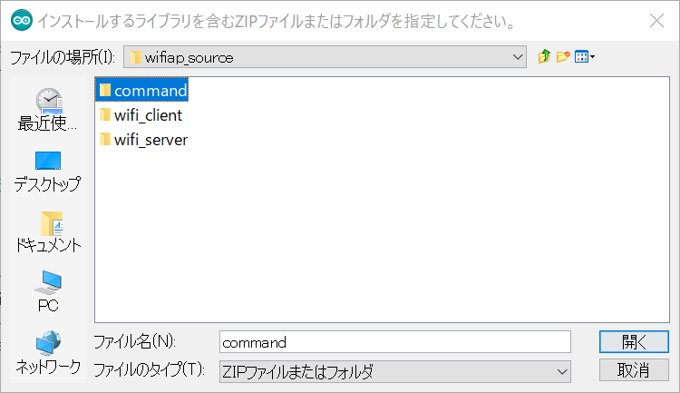
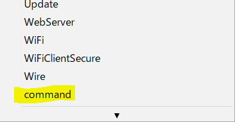

# ESP32 Wi-Fi 双方向通信サンプルプログラム

## 概要

CQ出版のインターフェース 2018年 9月号の特集第4部第1章 にて使用している、ESP32同士で双方向通信を行うサンプルのソースコードです。

## 使い方

### スケッチを開く

ダウンロードしたソースコードの `wifi_client` および `wifi_server` ディレクトリにある `wifi_client.ino` と `wifi_server.ino` を Arduino IDEで開きます。

### commandライブラリを追加

`スケッチ - ライブラリをインクルード - .ZIP形式のライブラリをインストール` を選択して、ダウンロードしたソースコードの `command` ディレクトリを指定します。

`スケッチ - ライブラリをインクルード` メニューに `command` が追加されるので、選択します。

### スケッチの書き込み

通常どおり、対象のESP32にスケッチを書き込みます。

## ライセンスと免責事項

`command.hpp` はBoost Software Licenseとします。ソースコード中のライセンス表記を消さない限り、自由に使用できます。

`wifi_client.ino` と `wifi_server.ino` は特に明記せず自由に改変して使用してください。

ただし、これらのソースコードを使用して発生したいかなる損害に対しても、作者は責任を負わないものとします。

